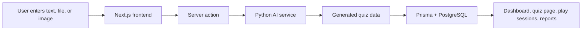

# QuizWarp

AI-driven dynamic assessment and gamification engine for educators and learners.

QuizWarp turns source material into interactive quizzes in seconds, then wraps the experience in gamified learning flows such as AI credits, streaks, live sessions, async assignments, flashcard study, and detailed performance reports.

## What this project does

QuizWarp helps teachers and students move from static content to measurable learning experiences:

- Generate assessments from **text, files, or images**
- Choose from **multiple question formats**:
  - Multiple Choice
  - True / False
  - Identification
  - Essay
- Create quizzes in multiple languages, including:
  - English
  - Filipino
  - Taglish
  - Spanish
  - French
  - Japanese
- Host **live game sessions** with join codes and faction/team play
- Assign **async homework sessions** with due dates
- Let students take **practice quizzes** and **flashcard study** sessions
- Grade essay responses with an AI-powered backend service
- Track learner progress with **reports, streaks, rewards, and AI insights**

## Why it matters

Traditional quiz creation is slow, repetitive, and difficult to personalize at scale. QuizWarp improves that by:

- Reducing assessment prep time
- Turning any learning material into usable quizzes quickly
- Supporting both classroom game sessions and self-paced practice
- Providing instant scoring and feedback for better engagement
- Giving teachers visibility into class performance and weak topics
- Adding gamification so learners stay motivated

## Key benefits

- **For teachers:** faster quiz creation, reusable question banks, live classrooms, assignment tracking, and final reports
- **For students:** instant feedback, practice mode, study cards, streak rewards, and a more engaging experience
- **For teams and classrooms:** faction-based competition, join codes, and session-level performance summaries

## How it works



### Main data flow

1. A user signs in with Supabase or continues anonymously.
2. The homepage collects source material and quiz settings.
3. A server action sends the request to the Python AI service.
4. The AI service returns quiz content, explanations, and structure.
5. Authenticated users save quizzes to PostgreSQL through Prisma.
6. Quizzes can then be:
   - edited or reused from the dashboard
   - assigned as async work
   - hosted as live sessions
   - practiced in study mode
7. Student responses are stored and later summarized in reports, including AI-generated class insights.

## Main features

### Quiz generation

- Paste text, upload a file, or upload an image
- Select question type, difficulty, number of questions, and language
- Generate quizzes using the AI service
- Anonymous users are limited by fingerprint-based usage tracking
- Signed-in users spend AI credits when generating quizzes

### Dashboard and quiz management

- View created quizzes
- Organize active assignments and completed reports
- Manage a reusable question bank
- Copy join links and end sessions
- Track streaks, rewards, and active live sessions

### Live and async gameplay

- Create live rooms with a join code
- Group players into factions for competitive play
- Run async assignment sessions with due dates
- Start practice quizzes for self-paced learning
- Clean up temporary practice sessions automatically

### Reports and insights

- View final grades and participation summaries
- Export report data
- Generate AI insights from class performance
- Identify difficult questions and learning gaps

### Authentication and accounts

- Email/password sign up and login
- Google and Facebook OAuth support
- Teacher / student account roles
- Supabase-based auth session handling

## Tech stack

- **Framework:** Next.js 16
- **UI:** React 19, Tailwind CSS
- **Database:** PostgreSQL
- **ORM:** Prisma
- **Auth:** Supabase
- **AI integration:** Python microservice via HTTP
- **Utilities:** FingerprintJS, react-hot-toast, date-fns, lucide-react

## Project structure

```text
src/
  app/
    _components/          # Shared homepage and quiz UI
    dashboard/            # Teacher dashboard, reports, question bank, settings
    host/                 # Live session host views
    play/                 # Live / async student gameplay
    quiz/                 # Saved quiz preview/editor
    study/                # Flashcard study mode
    join/                 # Join session flow
    login/ signup/        # Authentication pages
    actions.ts            # Core server actions for quizzes, sessions, and grading
  lib/                    # Prisma client and DB connection helpers
  utils/supabase/        # Supabase browser/server client helpers
prisma/
  schema.prisma          # Database schema
  seed.ts                # Seed data
public/
  sounds/                # UI sound effects
```

## Database model overview

The Prisma schema centers around these entities:

- **User** – teacher/student account, AI credits, streaks, and hosted quizzes
- **Quiz** – generated assessment owned by a user
- **Question** – question text, options, answer, explanation, type, and time limit
- **GameSession** – live or async session with join code, status, mode, and faction count
- **Participant** – a learner inside a session
- **ParticipantResponse** – per-question answer, score, correctness, and AI feedback
- **Faction** – team grouping for live sessions
- **AnonymousUsage** – fingerprint-based usage limit for guest generation

## Supported user flows

### Teacher flow

1. Sign up or log in.
2. Generate quizzes from source material.
3. Save and manage the quiz library.
4. Start a live session or assign async homework.
5. Review reports, AI insights, and completion data.

### Student flow

1. Join a live session with a code or open an assignment.
2. Answer questions and receive instant feedback.
3. Build streaks and earn rewards through activity.
4. Use flashcard study and practice mode for review.

### Anonymous visitor flow

1. Generate quizzes without an account.
2. Store generated quizzes locally in the browser.
3. Continue until the fingerprint-based generation limit is reached.

## Environment variables

Create a `.env.local` file with the values required by your deployment:

```bash
DATABASE_URL=postgresql://...
NEXT_PUBLIC_SUPABASE_URL=https://...
NEXT_PUBLIC_SUPABASE_ANON_KEY=...
NEXT_PUBLIC_SITE_URL=http://localhost:3000
PYTHON_AI_URL=http://127.0.0.1:5000
```

### Notes

- `DATABASE_URL` is required for Prisma.
- `NEXT_PUBLIC_SUPABASE_URL` and `NEXT_PUBLIC_SUPABASE_ANON_KEY` are required for Supabase auth.
- `NEXT_PUBLIC_SITE_URL` is used in auth redirects.
- `PYTHON_AI_URL` points to the AI microservice that generates quizzes and grades answers.

## Getting started

### 1) Install dependencies

```bash
npm install
```

### 2) Prepare the database

```bash
npm run db:generate
npm run db:push
```

If you use migrations:

```bash
npm run db:migrate
```

### 3) Seed sample data

```bash
npm run db:seed
```

### 4) Run the app

```bash
npm run dev
```

Open the app at `http://localhost:3000`.

## Available scripts

- `npm run dev` – start the development server
- `npm run build` – generate Prisma client and build the app
- `npm run start` – run the production server
- `npm run lint` – run ESLint
- `npm run db:generate` – generate Prisma client
- `npm run db:push` – push schema changes to the database
- `npm run db:migrate` – create and apply a migration
- `npm run db:seed` – seed starter data
- `npm run db:test` – run the database test script
- `npm run db:studio` – open Prisma Studio

## Implementation notes

- Auth is handled through **Supabase SSR** helpers and protected routes.
- Quiz generation and essay grading are delegated to a Python AI API.
- Prisma persists quizzes, sessions, participants, and response data in PostgreSQL.
- The dashboard uses session state, streaks, credits, and report pages to create a more engaging learning loop.

## Good fit use cases

- Classroom quiz creation from lecture notes, readings, or screenshots
- Homework assignments with deadlines and progress tracking
- Live review games for competitive classroom sessions
- Practice mode for self-study and revision
- Analytics for identifying common misconceptions after a session

## License

No license file is included yet. Add one before publishing publicly if you want to define reuse terms.

